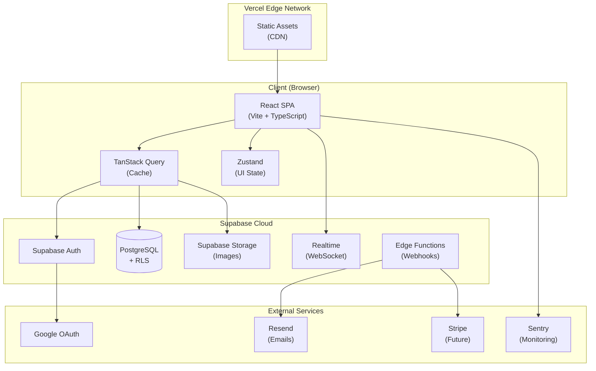
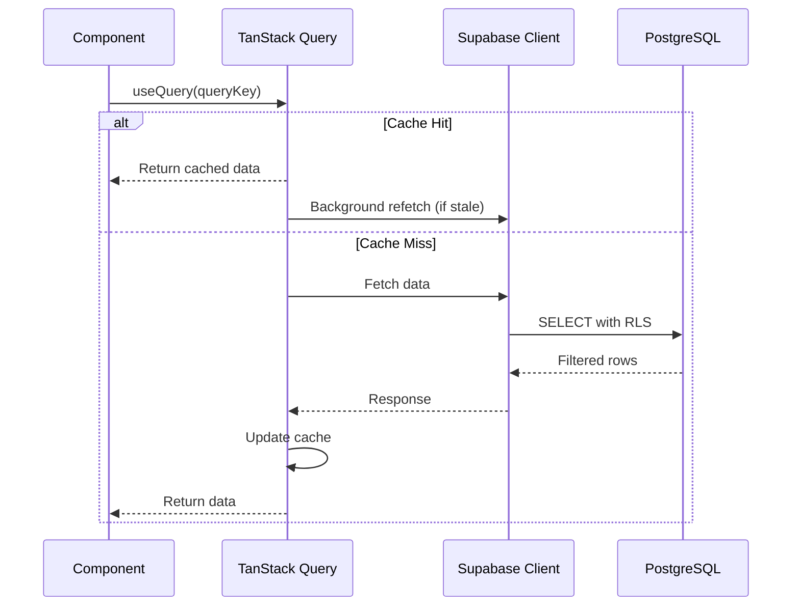
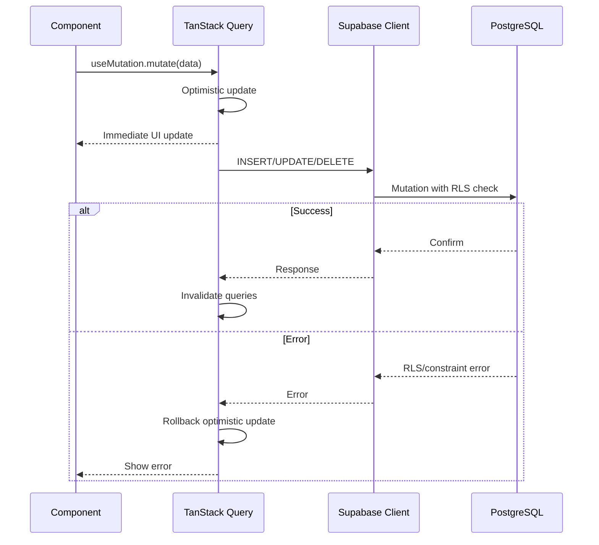
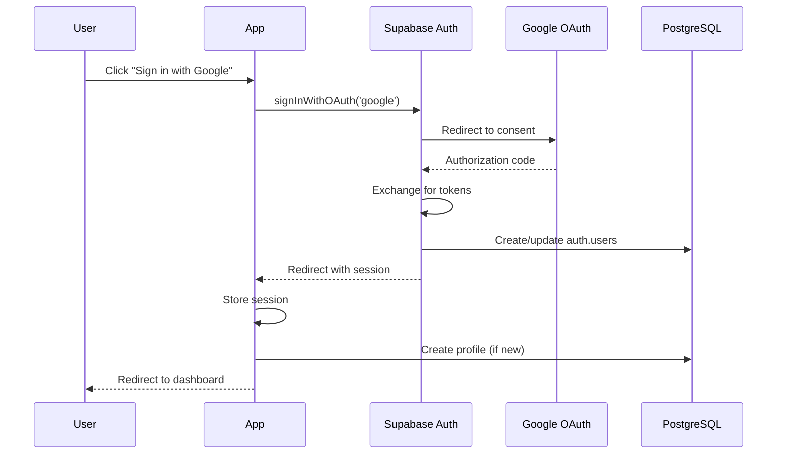
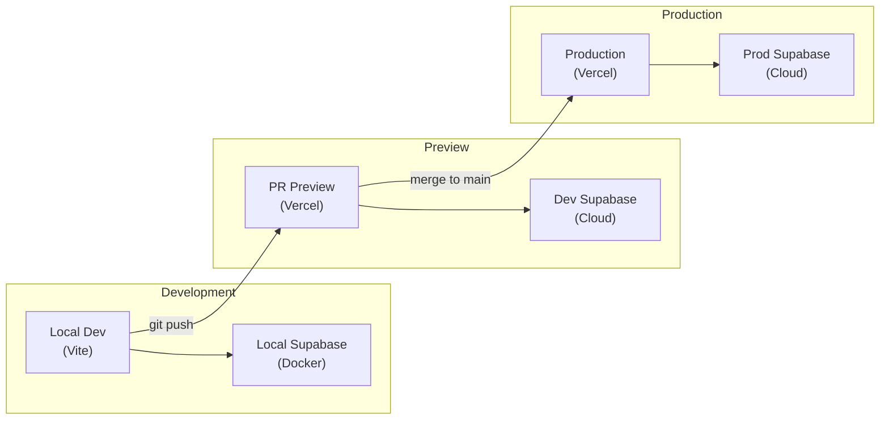

# Architecture Overview

> Technical architecture for EA Platform

---

## System Diagram



---

## Component Architecture

### Feature-Based Organization

Components are organized by feature rather than type, promoting colocation and maintainability.

```
src/
├── components/
│   ├── ui/                    # shadcn/ui components
│   │   ├── button.tsx
│   │   ├── card.tsx
│   │   ├── dialog.tsx
│   │   ├── form.tsx
│   │   ├── input.tsx
│   │   └── ...
│   │
│   ├── layout/                # Layout components
│   │   ├── header.tsx
│   │   ├── sidebar.tsx
│   │   ├── footer.tsx
│   │   └── dashboard-layout.tsx
│   │
│   └── features/              # Feature components
│       ├── auth/
│       │   ├── login-form.tsx
│       │   ├── signup-form.tsx
│       │   └── auth-provider.tsx
│       │
│       ├── artists/
│       │   ├── artist-card.tsx
│       │   ├── artist-profile.tsx
│       │   ├── artist-search.tsx
│       │   └── artist-form.tsx
│       │
│       ├── venues/
│       │   ├── venue-card.tsx
│       │   ├── venue-profile.tsx
│       │   ├── venue-search.tsx
│       │   └── venue-form.tsx
│       │
│       ├── bookings/
│       │   ├── booking-card.tsx
│       │   ├── booking-list.tsx
│       │   ├── booking-form.tsx
│       │   └── booking-status.tsx
│       │
│       └── messages/
│           ├── message-thread.tsx
│           ├── message-input.tsx
│           └── message-list.tsx
│
├── pages/                     # Route pages
│   ├── index.tsx              # Landing/Dashboard
│   ├── login.tsx
│   ├── signup.tsx
│   ├── artists/
│   │   ├── index.tsx          # Artist search
│   │   └── [id].tsx           # Artist profile
│   ├── venues/
│   │   ├── index.tsx          # Venue search
│   │   └── [id].tsx           # Venue profile
│   ├── bookings/
│   │   ├── index.tsx          # Booking list
│   │   └── [id].tsx           # Booking detail
│   ├── messages/
│   │   └── index.tsx          # Message threads
│   └── settings/
│       └── index.tsx          # User settings
│
├── hooks/                     # Custom hooks
│   ├── use-auth.ts
│   ├── use-artists.ts
│   ├── use-venues.ts
│   ├── use-bookings.ts
│   ├── use-messages.ts
│   └── use-media-query.ts
│
├── services/                  # API/External services
│   ├── supabase.ts            # Supabase client
│   ├── api/
│   │   ├── artists.ts
│   │   ├── venues.ts
│   │   ├── bookings.ts
│   │   └── messages.ts
│   └── storage.ts             # File upload helpers
│
├── stores/                    # Zustand stores
│   ├── ui-store.ts
│   └── filter-store.ts
│
├── schemas/                   # Zod schemas
│   ├── auth.ts
│   ├── artist.ts
│   ├── venue.ts
│   ├── booking.ts
│   └── common.ts
│
├── types/                     # TypeScript definitions
│   ├── database.types.ts      # Generated from Supabase
│   └── index.ts               # App-specific types
│
├── lib/                       # Utilities
│   ├── utils.ts               # General utilities
│   ├── cn.ts                  # Class name helper
│   ├── query-client.ts        # TanStack Query setup
│   ├── query-keys.ts          # Query key factory
│   └── constants.ts           # App constants
│
├── styles/                    # Global styles
│   └── globals.css            # Tailwind imports
│
├── test/                      # Test utilities
│   ├── setup.ts
│   ├── mocks/
│   └── utils.tsx
│
├── App.tsx                    # Root component
├── main.tsx                   # Entry point
└── vite-env.d.ts              # Vite types
```

---

## Data Flow

### Read Operations (Query)



### Write Operations (Mutation)



---

## Authentication Flow



---

## Third-Party Integrations

| Service | Purpose | Integration Point |
|---------|---------|-------------------|
| **Google OAuth** | User authentication | Supabase Auth provider |
| **Resend** | Transactional emails | Supabase Edge Function |
| **Sentry** | Error tracking & monitoring | Client-side SDK |
| **Stripe** (Future) | Payment processing | Edge Function webhooks |

### Integration Architecture

```
┌──────────────────────────────────────────────────────────┐
│                     EA Platform SPA                       │
├──────────────────────────────────────────────────────────┤
│  Sentry SDK          Supabase Client                     │
│  (Error tracking)    (Auth, DB, Storage, Realtime)       │
└──────────────────────────────────────────────────────────┘
                              │
                              ▼
┌──────────────────────────────────────────────────────────┐
│                    Supabase Cloud                         │
├────────────────┬─────────────────┬───────────────────────┤
│  Supabase Auth │   PostgreSQL    │   Edge Functions      │
│       │        │                 │        │              │
│       ▼        │                 │        ▼              │
│  Google OAuth  │                 │   Resend (email)      │
│                │                 │   Stripe (webhooks)   │
└────────────────┴─────────────────┴───────────────────────┘
```

---

## Security Architecture

### Row Level Security (RLS)

```sql
-- Example: Users can only access their own profile
CREATE POLICY "Users can view own profile"
ON profiles FOR SELECT
USING (auth.uid() = id);

-- Example: Users can view public artist profiles
CREATE POLICY "Public can view artists"
ON profiles FOR SELECT
USING (type = 'artist' AND is_public = true);

-- Example: Booking access for participants only
CREATE POLICY "Booking participants can view"
ON bookings FOR SELECT
USING (
    artist_id = auth.uid() OR
    venue_id = auth.uid()
);
```

### Security Layers

```
┌─────────────────────────────────────────┐
│           Application Layer              │
│  - Input validation (Zod)               │
│  - CSRF protection                       │
│  - XSS prevention (React)               │
└─────────────────────────────────────────┘
                    │
                    ▼
┌─────────────────────────────────────────┐
│           API Layer (Supabase)          │
│  - JWT validation                        │
│  - Rate limiting                         │
│  - CORS configuration                    │
└─────────────────────────────────────────┘
                    │
                    ▼
┌─────────────────────────────────────────┐
│           Database Layer                 │
│  - Row Level Security (RLS)             │
│  - Column-level encryption (sensitive)  │
│  - Audit logging                         │
└─────────────────────────────────────────┘
```

---

## Deployment Architecture



### Environment Configuration

| Environment | URL | Supabase Project |
|-------------|-----|------------------|
| Development | `localhost:5173` | Local (Docker) or Dev |
| Preview | `pr-*.vercel.app` | Development |
| Production | `eaplatform.com` | Production |

---

## Performance Considerations

### Code Splitting

```typescript
// Route-based code splitting
const ArtistProfile = lazy(() => import('./pages/artists/[id]'))
const VenueProfile = lazy(() => import('./pages/venues/[id]'))
const Bookings = lazy(() => import('./pages/bookings'))
const Messages = lazy(() => import('./pages/messages'))
```

### Caching Strategy

| Data Type | Stale Time | Cache Time | Refetch On |
|-----------|------------|------------|------------|
| User profile | 5 min | 30 min | Window focus |
| Artist/Venue listings | 1 min | 5 min | Filter change |
| Booking details | 30 sec | 5 min | Always |
| Messages | 0 (real-time) | 1 min | WebSocket |

### Image Optimization

- Use Supabase Storage transformations for thumbnails
- Lazy load images below the fold
- Use `srcset` for responsive images
- WebP format with JPEG fallback

---

## Scalability Considerations

### Current Architecture (MVP)

- Single Supabase project
- Vercel auto-scaling
- Connection pooling via Supavisor

### Future Scaling Options

1. **Database**: Supabase Pro for more connections, replicas
2. **Storage**: CDN caching for images
3. **Real-time**: Separate channels per booking/thread
4. **Search**: Consider Algolia/Meilisearch for complex search

---

## References

- [ADR-001: Frontend Framework](../decisions/ADR-001-frontend-framework.md)
- [ADR-002: Backend Service](../decisions/ADR-002-backend-service.md)
- [ADR-005: Database Strategy](../decisions/ADR-005-database-strategy.md)
- [ADR-006: Hosting & Deployment](../decisions/ADR-006-hosting-deployment.md)
